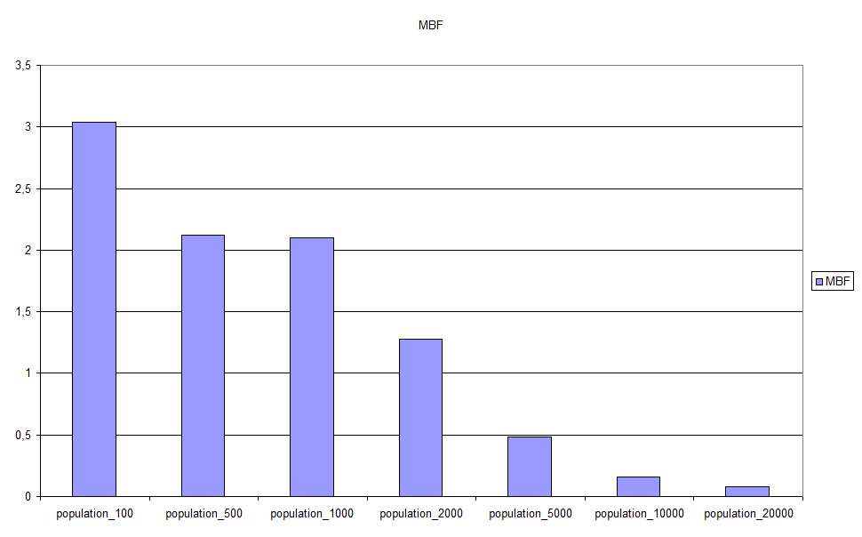

# Computación Evolutiva - Activity No. 6

## Ansgar Mikel Nell Artolazabal

# <a class="toc" name="toc-Section-1">1</a> Introduction

A Sudoku is a puzzle pastime where a 9 × 9 grid is presented divided in smaller 3 × 3 grids. Most of this grids spaces are blank, and others are filled with numbers between 1-9\. The objective is to fill the blank squares so that there are no repeated numbers neither in the 3 × 3 grids nor in the 9 × 9 grids columns nor rows, as it can be seen in the Fig. [1↓](#fig:Start-puzzle-(a)).

  

(a) 

(b) 

Figure 1 Start puzzle (a) and resolved (b) Sudoku game

Finding the solution of a Sudoku game is a constraint satisfaction problem (CSP).

The problem can be considered in some way as a mixing between the traveling salesman problem, where the shortest distance between a given list of cities must be found permuting the route that will be taken. A similar action must be done in the Sudoku’s 3 × 3 grid, rearranging the 9 numbers, thus in this case there is no function to be calculated. On the other hand, it recalls the eight queens problem, which have to be placed in a chess table avoiding eating each other. In a similar way, the Sudoku row and columns can’t have the same number two or more times.

# <a class="toc" name="toc-Section-2">2</a> Constraint handling

Resolving a CSP with Evolutionary Algorithms (EA) requires transforming the original problem into a constrained optimization problem (COP). There are several ways for achieving this. The next list shows the most common ones [[1](#biblio-1)]:

1.  A function is applied to the result so that infeasible solutions are penalized and their fitness is reduced. Usually the penalization is proportional to the number of violated constraints.
2.  “Repair” a unfeasible solution returning a feasible one.
3.  Ensure the feasibility of all solutions via a specific representation for the problem, as initialization, mutation and recombination.
4.  Use a “decoder” from genotypes to phenotypes so that the last ones are always feasible.

The penalty function that will be used counts how many numbers are repeated in each row and column, or, to express it in another way, how many numbers are missing. Mathematically it can be expressed like [[4](#biblio-4)]:\begin_inset Separator latexpar\end_inset

<a class="eqnumber" name="eq:1">(1)</a> _f_(_x_) = 9⎲⎳_i_ = 1_g__i_(_x_) + 9⎲⎳_j_ = 1_h__j_(_x_)  _g__i_(_x_) = |_x__i_|,  _h__j_(_x_) = |_x__j_|

In this case |.| indicates the number of same numerals in a row or column.

# <a class="toc" name="toc-Section-3">3</a> Evolutionary Algorithm selection

This problem is well suited to be resolved using Genetic Algorithms, as we want to find an optimal solution searching in a solution space [[6](#biblio-6)]. In this kind of EA the genes of the individuals evolve similarly to how evolution works in nature, selecting the fittest parents which will create offspring individuals. This will mutate with some probability optimizing their solution, so that every generation will be closer to the exact solution.

## <a class="toc" name="toc-Subsection-3.1">3.1</a> Representation

The genes chosen for this problem will represent the 9 × 9 through an integer array, although virtually the grid is divided into smaller 3 × 3 grids, so there will be 9 3 × 3 arrays. Each of them will be a permutation representation as this is the operation that will create new different solutions.

There will be two ways for accessing the grid: an absolute one, where the used form is [9][9], and another one, where each sub-grid will be located in a [3][3] position in the grid, as can be seen in Fig. [2↓](#fig:-sub-arrays).

Figure 2 3 × 3 sub-arrays

To maintain the fixed numbers that are given as input to the puzzle through mutation, recombination and initialization, they are converted into negative values. Therefor calculations are made with absolute values.

## <a class="toc" name="toc-Subsection-3.2">3.2</a> Evaluation

As showed in formula [1↑](#eq:1), the evaluation will count how many numbers are repeated in each row and column, and the sum will be the individual’s fitness. Logically, if a solution is found there will be no duplicates and the fitness will sum zero, so this is an inverse fitness optimization problem where the main goal will be to reach zero.

## <a class="toc" name="toc-Subsection-3.3">3.3</a> Recombination

There are four different recombination operators for permutation representations that have been used so far [[1](#biblio-1)]:

1.  Partially Mapped Crossover
2.  Edge Crossover
3.  Order Crossover
4.  Cycle Crossover

The two last ones are not applicable for the Sudoku problem because the order is not relevant, nor it is the absolute position. On the other hand, it has been verified that cycle crossover has worst properties of locality [[2](#biblio-2)]. Sudoku represents a special case from a permutation point of view, due to the fact that preserving order or relative position does not have better results because of the interdependency between sub-grids. Therefor the permutation operator introduced by Sato [[3](#biblio-3)] will be used, where crossover is done based on rows for the first child and based on columns for the second. In each case, the fittest row or column from both parents will be selected preserving highly fit results, as it can be seen in Fig. [3↓](#fig:Sato's-row-and). It must be noted that this rows and columns refer to the sub-grids, meaning that each position is a 3 × 3 grid, and the related fitness is the sum of fitness in groups of three rows or columns.

Figure 3 Sato’s row and columns fitness based crossover (taken from [[4](#biblio-4)])

## <a class="toc" name="toc-Subsection-3.4">3.4</a> Mutation

There are also four mutation types which can be selected when permutation is used: Swap, insert, scramble and inversion. For the current problem, the only feasible option is the swap operator as it is the only one that does not alter significantly the so far obtained results, because it changes only two positions.

It must be noted that the mutation probability will affect each 3 × 3 grid separately, so for an individual the total probability of having a change in its numbers is nine times bigger.

## <a class="toc" name="toc-Subsection-3.5">3.5</a> Parent Selection

The simplest parent selection method is the fitness proportional selection. However, this approach suffers from some problems like premature convergence or more sensitivity to outlying fitness values which can cause that a very fit individual dominates the intermediate population and reduces diversity [[5](#biblio-5)], so the alternative ranking selection will be used, in order to distribute selection probability more adequately.

The selection probability will be implemented with the roulette wheel algorithm. Tournament selection is dismissed because there is no problem to have knowledge of the entire population.

## <a class="toc" name="toc-Subsection-3.6">3.6</a> Replacement

For survival selection, elitism will be used to preserve the current fittest members, but any other individual will be replaced by the offspring using age-based replacement.

# <a class="toc" name="toc-Section-4">4</a> Parameters

## <a class="toc" name="toc-Subsection-4.1">4.1</a> Mutation rate, dynamic vs. fixed

Tests have been made to determine if a dynamic mutation rate (MR) approach, based on the main population fitness, is better than having a fixed rate that does not vary along the execution generations. The formula that has been used for changing the mutation rate is a simple one, which selects the minimum between 0.90 and a constant divided by the mean fitness. This minimum has been introduced to avoid endless loops in case that the mutation rate goes above 1.0.

<a class="eqnumber" name="eq-2">(2)</a> _ρ_’ = _min_[0.90,  _α__n_ ⁄ _n_⎲⎳_i_ = 0_f_(_x__i_)]

where _f_(_x__i_) stands for the fitness of the individual i.

Different values for _α_ have been tried: 1, 2, 3, 4, 5, 6, 7, 8, 9 and 10\. For the fixed MR, values 0.05, 0.10, 0.15, 0.20, 0.25, 0.30 and 0.40 have been used. However, the performance obtained with 0.40 was so poor that it has been discarded in order to not alter the graphics scale.

The obtained results show clearly that the best results are obtained using a fixed MR, as it can be seen in the next analysis. The data were obtained after performing 50 executions for each type of MR, with a 3000 members population, 500 parents through 1000 generations.

### <a class="toc" name="toc-Subsubsection-4.1.1">4.1.1</a> Fitness

In the next figures the obtained fitness is shown, being zero the best value.

### MBF

Figure 4 Mean Best Fitness (MBF) results for different mutation rates

There are two groups that can be considered as the best. One is the dynamic MR between values 5-8, with 7 as the best, and the second one is located on the right, including fixed MR 0.15-0.30, being the best the last one globally. Nevertheless, the dynamic group can be considered better than the fixed group.

### SR

Figure 5 Success Rate (SR) results for different mutation rates

The success rate measure results match the previous ones, having the fixed MR with 0.30 as its best member. Again, the dynamic group has better performance than the fixed group.

### <a class="toc" name="toc-Subsubsection-4.1.2">4.1.2</a> Generations

The next analysis is done based on how much generations have passed before finding the solution only when it is found.

### AES

Figure 6 Average number of Evaluations to a Solution (AES) measured in generations for different MRs

The AES shows different results than before. However, it must be noted that this measure is only taken over the successful runs. Therefor, those executions that have less SR can have better AES results if they get the solution quickly in the few times they find it.

### Peak generations

Figure 7 Peak generations measure for different MRs

Again, the group that showed best behaviour in the fitness analysis is the worst in speed.

Based on the obtained results, it can be concluded that the best choice would be to have a fixed mutation rate of 0.30, followed very closely by the dynamic MR with 7 as its _α_ constant value.

## <a class="toc" name="toc-Subsection-4.2">4.2</a> Population

To study how the population count affects to the results, some test have been made with 100, 500, 1000, 2000, 5000, 10000 and 20000 individuals populations. Again, 50 executions through 1000 generations have been done, using the fixed mutation rate of 0.30 obtained in the previous section. This time, the parents count used was 50 for the 1000 individuals population, 250 for 500 and 500 parents above that number. The execution time for each test has increased with the population, as can be seen in the next table:

<table>

<tbody>

<tr>

<td align="center" valign="top">Population count</td>

<td align="center" valign="top">Execution time (in min)</td>

</tr>

<tr>

<td align="center" valign="top">100</td>

<td align="center" valign="top">3</td>

</tr>

<tr>

<td align="center" valign="top">500</td>

<td align="center" valign="top">6</td>

</tr>

<tr>

<td align="center" valign="top">1000</td>

<td align="center" valign="top">10</td>

</tr>

<tr>

<td align="center" valign="top">2000</td>

<td align="center" valign="top">15</td>

</tr>

<tr>

<td align="center" valign="top">5000</td>

<td align="center" valign="top">22</td>

</tr>

<tr>

<td align="center" valign="top">10000</td>

<td align="center" valign="top">28</td>

</tr>

<tr>

<td align="center" valign="top">20000</td>

<td align="center" valign="top">39</td>

</tr>

</tbody>

</table>

Table 1 Execution times for different population count

It can be seen that the needed time increases as the population gets bigger, but there is little difference between the 5000 population and the 10000 one, compared with the 20000 individuals population. This can be explained considering that as the program breaks the search if a solution is found, when the success rate increases, less time is needed for that execution. This, together with the similar SR for the biggest populations (46% for 10000 and 48% for 20000) explain this data.

### <a class="toc" name="toc-Subsubsection-4.2.1">4.2.1</a> Fitness

The next section analyzes how the population count affects to the obtained mean fitness and success rate.

### MBF

Figure 8 Mean Best Fitness (MBF) results for different populations

The graphic shows the expected behaviour, that is, the MBF is smaller as the population grows. So, the best execution is obtained with a 20000 members population. It is noticeable that the difference between the 500 and 1000 individuals populations is very slight, despite being twice bigger.

### SR

Figure 9 Success Rate (SR) results for different populations

The success rate measure results match the previous ones. Both the 10000 and the 20000 are above 90% success rate (92% and 96% respectively).

### <a class="toc" name="toc-Subsubsection-4.2.2">4.2.2</a> Generations

Next the influence of the population count is measured in order to know how it affects the speed of finding a solution.

### AES

Figure 10 Average number of Evaluations to a Solution (AES) measured in generations for different populations

This time the best member has also the quickest results, needing in average slightly more than 119 generations to find the solution. This, together with its success rate makes it a quick and reliable configuration.

### Peak generations

Figure 11 Peak generations measure for different populations

Coherently with the other graphics, the quickest of all executions has been the 20000 members option needing only 27 generations to solve the puzzle.

In conclusion the best option, despite its global execution time from 39 minutes, is the biggest population as it has the maximum probability to find the Sudoku puzzle solution through various executions.

# <a class="toc" name="toc-Section-5">5</a> Program Structure

The Sudoku solving application has been developed in Java using the NetBeans IDE [A]  [A] https://netbeans.org/. It has a simple interface where the current and previous executions results can be monitored. It also allows to select the parameters configuration file and start the test choosing which Sudoku puzzle must be solved.

For output, a name must be given to the current test, and all data will be written in a folder with the same name. This folder contains three files:

*   Data_results__test_name_.txt: this file contains the solution obtained in each execution, and the achieved fitness.
*   Fitness_results__test_name_.txt: here the fitness results for each execution can be found, in CSV format.
*   Generations_results__test_name_.txt: the same as above, but measured in generations needed to find the solution (or maximum allowed generations if none was found).

The program is divided into several packages and classes according to their function as explained next.

## <a class="toc" name="toc-Subsection-5.1">5.1</a> ce_activity6

This package contains those classes used for input/output actions:

### CE_Activity6_Population

This class consists of a simple window where the desired best members data is shown.

### DataWriter

The three results files are created and populated with this class, as its name suggests.

### InformationPanel

An interface class to share information between different classes.

### MainWindow

This class contains the main window of the application.

### SudokuReader

Used to read the Sudoku puzzle from a text file.

## <a class="toc" name="toc-Subsection-5.2">5.2</a> evolution

This is the main package, where the evolution motor resides. It is composed by two classes:

### Evolution

The main evolutionary algorithm is located here, with the usual steps:

*   Initialization
*   Evaluation
*   Parent selection
*   Recombination
*   Mutation
*   Replacement

### Parameters

This class reads the parameters from the configuration file, and stores them to be used by other classes.

## <a class="toc" name="toc-Subsection-5.3">5.3</a> individual

It contains only a class, with the same name.

### Individual

This is the representation of each individual member. The most important variables are a 9x9 array to store the individual’s solution, and an integer to represent its fitness.

## <a class="toc" name="toc-Subsection-5.4">5.4</a> steps

This package extends every step from the evolutionary algorithm described above:

### Initialization

### Evaluation

### ParentSelection

### Recombination

### Mutation

### Replacement

## <a class="toc" name="toc-Subsection-5.5">5.5</a> utils

Here we can find three auxiliary classes that order lists based on their fitness or probability:

### IndSortByFitness

### IndSortByInverseFitness

### IndSortByProbability

# <a class="toc" name="toc-Section-6">6</a> Conclusions

Starting with a CSP, it has been transformed into a COP through constraint handling. After studying different representation, mutation rates and recombination techniques, an efficient approximation has been obtained where a optimum parameters setting allows solving different Sudoku puzzles with an acceptable performance.

# References

[<a class="biblioentry" name="biblio-1">1</a>] Agoston E. Eiben, J. E. Smith. _Introduction to Evolutionary Computing_. SpringerVerlag, 2003.

[<a class="biblioentry" name="biblio-2">2</a>] Edgar Galván-López, Michael O'Neill. On the effects of locality in a permutation problem: the Sudoku puzzle. _Proceedings of the 5th international conference on Computational Intelligence and Games_:80—87, 2009. URL [http://dl.acm.org.ezproxy.uned.es/citation.cfm?id=1719293.1719316](http://dl.acm.org.ezproxy.uned.es/citation.cfm?id=1719293.1719316).

[<a class="biblioentry" name="biblio-3">3</a>] Y. Sato, H. Inoue. Solving Sudoku with genetic operations that preserve building blocks. _Computational Intelligence and Games (CIG), 2010 IEEE Symposium on_:23-29, Aug..

[<a class="biblioentry" name="biblio-4">4</a>] Yuji Sato, Naohiro Hasegawa, Mikiko Sato. Acceleration of genetic algorithms for sudoku solution on many-core processors. _Proceedings of the 13th annual conference companion on Genetic and evolutionary computation_:407—414, 2011. URL [http://doi.acm.org.ezproxy.uned.es/10.1145/2001858.2002027](http://doi.acm.org.ezproxy.uned.es/10.1145/2001858.2002027).

[<a class="biblioentry" name="biblio-5">5</a>] Artem Sokolov, Darrell Whitley. Unbiased tournament selection. _Proceedings of the 2005 conference on Genetic and evolutionary computation_:1131—1138, 2005. URL [http://doi.acm.org.ezproxy.uned.es/10.1145/1068009.1068198](http://doi.acm.org.ezproxy.uned.es/10.1145/1068009.1068198).

[<a class="biblioentry" name="biblio-6">6</a>] Scott M. Thede. An introduction to genetic algorithms. _J. Comput. Sci. Coll._, 20(1):115—123, 2004. URL [http://dl.acm.org.ezproxy.uned.es/citation.cfm?id=1040231.1040247](http://dl.acm.org.ezproxy.uned.es/citation.cfm?id=1040231.1040247).

